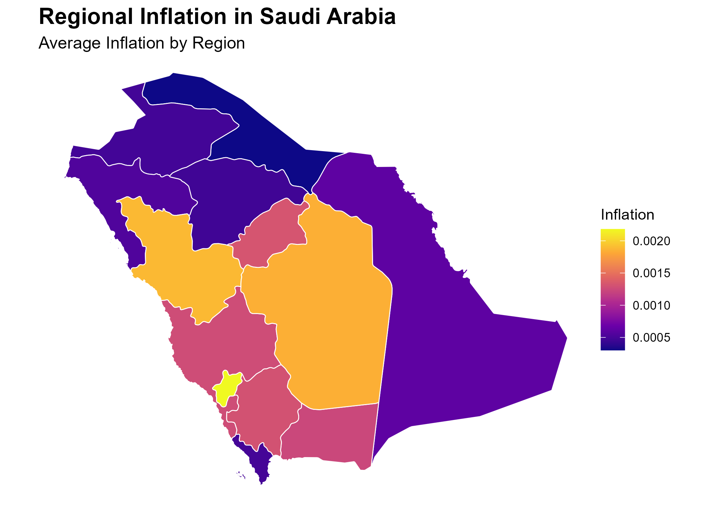

# MAKANI — Regional Inflation Dynamics in Saudi Arabia

[](LICENSE)

A reproducible empirical analysis of regional consumer price inflation
across Saudi Arabia's 13 administrative regions: common temporal
variation, local persistence, and the limits of spatial predictive
dependence. This repository is the **final, publication-ready reproducible
snapshot** of the MAKANI research program — raw government data in, a full
dynamic-panel econometric analysis and manuscript out, with every step
scripted and re-runnable end to end.

مشروع بحثي قابل لإعادة الإنتاج بالكامل لديناميكيات التضخم الإقليمي في
المملكة العربية السعودية عبر 13 منطقة إدارية، باستخدام بيانات الرقم
القياسي لأسعار المستهلك الشهرية الصادرة عن الهيئة العامة للإحصاء (GASTAT).

## Regional Coverage



*Map of Saudi Arabia's 13 administrative regions, shaded by each region's
mean month-over-month inflation rate over the full January 2013 – February
2026 sample. This is a **descriptive, geographic context figure** from the
project's exploratory phase (source: `results/figures/map.png`) — it shows
where each region sits and its average inflation level, and it is **not**
a map of the confirmatory spatial-dependence test. The color pattern
should not be read as evidence of statistical or causal spatial
relationships between neighbouring regions: this project's confirmatory
dynamic-panel analysis (see "Main findings" below) found no robust
spatial predictive dependence, despite the visual variation shown here.*

## Research question

> Do Saudi regional inflation dynamics primarily reflect common temporal
> variation, local regional persistence, or spatial predictive dependence
> across neighbouring regions?

## Geographic and temporal coverage

- **N = 13** Saudi Arabia administrative regions.
- **Monthly** Consumer Price Index, base year 2023 = 100.
- **January 2013 – February 2026** (T up to 158 calendar months; the final
  locked dynamic model's estimation sample is N=13 × T=154 = 2,002
  region-months after distributed-lag construction).
- Source: General Authority for Statistics (GASTAT), Saudi Arabia.

## Main findings (locked conclusions — see `paper.qmd` for full detail)

- **Common temporal variation accounts for a substantial share of regional
  inflation dynamics** — month fixed effects alone explain roughly 43% of
  total variance, versus under 1% for region fixed effects.
- **No robust spatial predictive dependence is detected in the available
  data** — at the contemporaneous, one-month, and distributed (up to
  six-month) lag horizons, after accounting for each region's own
  dynamics, across every tested spatial-weight matrix, dynamic horizon,
  inference method, and a full leave-one-region-out / influential-month
  robustness battery.
- Spatial evidence overall is classified **B — weak/suggestive but
  non-robust**: one nonlinear specification produces a nominally
  significant result that does not survive multiple-testing correction or
  cross-specification replication.
- Verified national policy-shock episodes (2015 energy-price reform, 2018
  VAT introduction/energy-price package, 2020 VAT rate increase) show no
  robust evidence of associated parameter instability.
- Inflation itself is broadly stationary; CPI **levels** are not (as
  expected for a trending price index).
- Residual temporal dynamics are classified **T2 — moderate but
  non-decisive persistence**: some serial dependence remains that no
  tested seasonal or extended-lag specification materially resolves.
- **This paper does not claim spatial dependence does not exist.** See the
  next section.

## Statistical-power limitation (read before interpreting the null result)

Because the cross-section is limited to N=13 regions, a calibrated
Monte Carlo power analysis (`scripts/20_power_mde_presubmission.R`,
`results_v2/presubmission_refinement/power_mde/`) was run to ask what
magnitude of cumulative spatial effect this exact design could reliably
detect. Result: power never reaches 80% anywhere within the pre-specified
effect-size grid — classified **P3, low power even for moderate effects**.
**Small and moderate spatial effects therefore cannot be fully ruled out**
by this study's null/weak result; absence of evidence is not treated here
as evidence of absence. This caveat is carried through the manuscript's
Abstract, Results, Discussion, Limitations, and Conclusion.

No result in this repository is a causal claim: month fixed effects
capture shared temporal variation without identifying which specific
economic mechanism produces it, and no spatial transmission, contagion, or
spillover is asserted as an established finding anywhere in this project.

## Main empirical strategy

A dynamic two-way-fixed-effects panel model, estimated with
Driscoll-Kraay panel-corrected inference (robust to cross-sectional and
serial correlation, appropriate for a small N=13 cross-section) and
validated with a wild-cluster (Rademacher) bootstrap:

```
pi_it = alpha_i + tau_t + sum_{k=1}^{3} phi_k * pi_{i,t-k}
                        + sum_{k=1}^{3} theta_k * (W * pi_{t-k})_i + e_it
```

with region fixed effects (`alpha_i`), month fixed effects (`tau_t`),
own-region lags 1–3 (`phi_k`), and Queen-contiguity row-standardized
spatial lags 1–3 (`theta_k`). This is the **final, locked** specification,
selected via a pre-specified hierarchy (theoretical coherence →
robustness → parsimony → residual adequacy → AIC/BIC as supporting
evidence only) after nonlinear, structural-shock, and temporal-extension
alternatives were tested and found not to clear that bar. See
`results_v2/final_robustness/FINAL_MODEL_DECISION.md` for the full
rationale.

## Repository structure

```
.
├── data_raw/                      Raw GASTAT CPI + cached region boundaries (bundled; see DATA_AVAILABILITY.md)
├── data_clean/                    v1 pipeline cache (rebuilt from data_raw)
├── data_v2/                       Canonical v2 region x month panel + immutable region-ID registry
├── baseline/v1.0/                 Frozen exploratory-baseline manifest (checksums, methodology note)
├── scripts/
│   ├── 01–08                      v1 exploratory pipeline (descriptive stats, correlation, Moran's I, LISA)
│   ├── 09                         Canonical v2 panel build
│   ├── 10                         Panel validation
│   ├── 11                         TWFE region/month variance decomposition
│   ├── 12                         Monthly permutation Moran's I (contemporaneous spatial dependence)
│   ├── 13                         Lag-1 spatial transmission test
│   ├── 14                         Distributed spatial lags (K=3, K=6) — linear reference model
│   ├── 15                         Nonlinear / state-dependent spatial dynamics
│   ├── 16                         Structural stability around verified national shock episodes
│   ├── 17                         Stationarity, seasonality, temporal dynamics
│   ├── 18                         Final robustness battery and model lock
│   ├── 20                         Simulation-based power / minimum-detectable-effect analysis
│   └── run_project.R              Runs the v1 pipeline end to end
├── results/                       v1 pipeline tables/figures
├── results_v2/                    v2 pipeline tables/figures/reports, one directory per stage
│   ├── tables/, figures/          Stage 11–12 (TWFE, Moran's I)
│   ├── distributed_spatial_lags/  Stage 14
│   ├── nonlinear_spatial_dynamics/ Stage 15
│   ├── structural_shocks/         Stage 16
│   ├── stationarity_temporal_dynamics/ Stage 17
│   ├── final_robustness/          Stage 18 (final result table, model decision, robustness figures)
│   ├── paper_integration/         Stage 19 (manuscript-integration audit and results crosswalk)
│   └── presubmission_refinement/  Stage 20 (power/MDE analysis, framing-refinement audit)
├── tests/testthat/                Panel-validation test suite (177 expectations)
├── research_notes/                Standalone methodological notes
├── paper.qmd                      The manuscript (Quarto: renders to HTML + Word)
├── paper.docx                     Rendered Word version
├── renv.lock / renv/              Locked R package versions
├── LICENSE / CITATION.cff
├── DATA_AVAILABILITY.md           Data provenance and license basis
└── REPRODUCIBILITY.md             Step-by-step reproduction guide
```

## Reproducibility

See **[REPRODUCIBILITY.md](REPRODUCIBILITY.md)** for full setup,
environment restoration (`renv::restore()`), the exact script run order for
both the v1 and v2 pipelines, expected runtimes (several Monte Carlo /
bootstrap stages take from minutes to hours), and manuscript rendering
instructions. PDF rendering of `paper.qmd` was not exercised in this
project's development environment (no LaTeX distribution available); HTML
and Word rendering are fully tested and reproducible.

## Data availability

Both raw inputs (GASTAT regional CPI; Natural Earth region boundaries) are
bundled in this repository — nothing is withheld. See
**[DATA_AVAILABILITY.md](DATA_AVAILABILITY.md)** for source, license basis
(Saudi Arabia's national Open Data Policy), and attribution terms.

## Scientific limitations

Summarized here; discussed in full in `paper.qmd`'s Limitations section:

- Small cross-section (N=13) limits statistical power for weak or
  heterogeneous spatial effects (see the power-analysis section above) —
  this bounds what can be *ruled out*, not the validity of the tests
  performed.
- Administrative-region aggregation may be too coarse to capture city- or
  market-level price propagation.
- No region × category (e.g. food, housing, transport) CPI history is
  available over a long enough window to test category-specific spatial
  dependence.
- Moderate residual temporal persistence remains unresolved by any tested
  extension (classification T2).
- Only Queen contiguity, KNN (k=4), and a distance-band spatial-weight
  matrix were tested (Queen and Rook are identical on this 13-region map
  and are not treated as independent checks).
- KNN and distance-band weights use great-circle distances between WGS84
  region centroids (spdep `longlat = TRUE`); the distance band is 1.05 x the
  largest nearest-neighbour distance (about 501 km). Up to v1.0 these two
  matrices used Euclidean distance on longitude/latitude degrees; the
  post-v1.0 correction and its before/after evidence are in
  `results_v2/distance_correction/`. Queen contiguity, the primary matrix,
  does not use distances and is unaffected.
- Every result is predictive/associational, not causal; verified
  national-shock episodes are tested for *association* with parameter
  instability, not for a causal treatment effect, and two of the three are
  explicitly confounded with other simultaneous national events.

## License & citation

Code and manuscript: MIT — see [LICENSE](LICENSE). Data: see
[DATA_AVAILABILITY.md](DATA_AVAILABILITY.md) for GASTAT/Natural Earth
terms. If you use this repository, its code, or its results, please cite
it as described in [CITATION.cff](CITATION.cff).

## Author

**Maha Rashed** — Graduate Student in Economics
