```{r setup, include=FALSE}
library(ggplot2)
library(dplyr)
library(sf)
library(plotly)
library(knitr)

knitr::opts_chunk$set(echo = FALSE, warning = FALSE, message = FALSE)

# Appendix A (the project's original exploratory baseline, v1) still needs
# these objects; the confirmatory v2 analysis in the main text below does
# NOT source any script here -- every v2 number is read directly from the
# already-committed CSV outputs of Stages 9-18 (see each chunk), per the
# Stage-19 instruction not to recompute or reopen any completed stage.
source("scripts/01_load_data.R")
source("scripts/02_clean_data.R")
source("scripts/03_exploratory_analysis.R")
source("scripts/04_spatial_analysis.R")
source("scripts/06_spatial_autocorrelation.R")
source("scripts/07_sensitivity_analysis.R")
source("scripts/05_plots.R")
```

## Abstract {.unnumbered}

```{r abstract-numbers}
tv <- read.csv("results_v2/tables/twfe_variance_decomposition_mom.csv")
month_share <- tv$share_of_total[tv$component == "Month (tau_t)"]
fr_final    <- read.csv("results_v2/final_robustness/tables/fr_K_final_result_table.csv")
fr_meta     <- read.csv("results_v2/final_robustness/tables/fr_K_final_model_metadata.csv")
fr_wcb_p    <- fr_meta$wcb_joint_p_value_B9999
```

This paper studies the dynamics of regional consumer price inflation across
Saudi Arabia's thirteen administrative regions using a monthly panel spanning
January 2013 to February 2026 (GASTAT, base year 2023 = 100). We ask whether
regional inflation dynamics primarily reflect common temporal variation,
local regional persistence, or spatial predictive dependence across
neighbouring regions. Using a dynamic two-way-fixed-effects panel model with
Driscoll-Kraay inference, distributed spatial lags, nonlinear/state-dependent
extensions, verified national policy-shock episodes, stationarity diagnostics,
a final battery of robustness checks (leave-one-region-out, influential
months, alternative spatial weights, alternative dynamic horizons, and
alternative inference methods), and a calibrated simulation-based power
analysis, we find that common temporal variation -- captured by month fixed
effects -- accounts for a substantial share of regional inflation variation
(`r round(100*month_share,1)`% of total sum of squares), while the available
13-region panel provides no robust evidence of spatial predictive dependence,
at the contemporaneous, one-month, and distributed (up to six-month) lag
horizons, after accounting for each region's own dynamics (final joint
spatial-lag wild-cluster-bootstrap p = `r round(fr_wcb_p,3)`, B = 9999). One
nonlinear specification produces a nominally significant result that does not
survive the complete multiple-testing and cross-specification robustness
framework. Verified national shock episodes (the 2015 energy-price reform,
the 2018 VAT introduction/energy-price package, and the 2020 VAT rate
increase) show no robust evidence of associated parameter instability.
Inflation itself is broadly stationary; CPI levels are not; moderate residual
temporal persistence remains. Because the cross-section is limited to 13
regions, a calibrated Monte Carlo power analysis indicates this design has
adequate power to detect only moderate-to-large cumulative spatial effects
and limited power for small ones (minimum detectable effect above the
largest pre-specified effect size tested, |Theta_3| = 0.20), so small spatial
effects cannot be ruled out by this null/weak result. We conclude that common
temporal variation and local region-specific dynamics, rather than spatial
transmission across neighbouring regions, characterize the empirical pattern
of Saudi regional inflation at the administrative-region level and the
horizons examined here: no robust spatial predictive dependence is detected
in the available data.

## Project Architecture (v1 Exploratory Pipeline) {.unnumbered}

```{r architecture-diagram, echo=FALSE, fig.width=5, fig.height=9}
stages <- c(
  "Raw GASTAT CPI",
  "Data Cleaning",
  "Panel Construction",
  "Exploratory Analysis",
  "Correlation Analysis",
  "Spatial Analysis",
  "Robustness Tests",
  "Economic Interpretation",
  "Publication Report"
)

n       <- length(stages)
box_h   <- 0.6
gap     <- 1
y_pos   <- rev(seq_len(n)) * gap

boxes <- data.frame(
  stage = stages,
  x     = 0,
  y     = y_pos,
  xmin  = -3, xmax = 3,
  ymin  = y_pos - box_h / 2, ymax = y_pos + box_h / 2
)

arrows <- data.frame(
  x    = 0, xend = 0,
  y    = boxes$ymin[-n],
  yend = boxes$ymax[-1]
)

ggplot() +
  geom_rect(
    data = boxes,
    aes(xmin = xmin, xmax = xmax, ymin = ymin, ymax = ymax),
    fill = "#eef3f8", color = "#2c3e50", linewidth = 0.6
  ) +
  geom_text(
    data = boxes, aes(x = x, y = y, label = stage),
    size = 4.2, fontface = "bold", color = "#2c3e50"
  ) +
  geom_segment(
    data = arrows, aes(x = x, y = y, xend = xend, yend = yend),
    arrow = arrow(length = unit(0.2, "cm"), type = "closed"),
    color = "#2c3e50", linewidth = 0.5
  ) +
  coord_cartesian(clip = "off") +
  theme_void()
```

*Figure A0. The project's original (v1) exploratory workflow, Stages 1-8*
*(`scripts/01`-`08`). This preceded, and does not supersede, the confirmatory*
*dynamic-panel analysis (v2, Stages 9-18) that forms the core of this paper;*
*see [Reproducibility] for the full v2 pipeline and commit history.*

## Introduction

Inflation dynamics remain a central concern for economic policy, particularly
in resource-dependent economies such as Saudi Arabia. National-level
inflation indicators provide a useful summary, but they may mask important
regional heterogeneity: are all thirteen of Saudi Arabia's administrative
regions simply riding the same national wave -- responding together to oil
prices, monetary policy, and nationwide fiscal changes such as VAT -- or do
regions also influence one another's inflation directly, with price pressure
in one region predicting subsequent price pressure in its geographic
neighbours?

This paper addresses that question directly:

> **Do Saudi regional inflation dynamics primarily reflect common national
> temporal shocks, local regional persistence, or spatial predictive
> dependence across regions?**

We do not begin from the premise that regional spatial spillovers exist. The
empirical strategy is built to let each of the three candidate explanations
fail on its own terms -- through explicit joint hypothesis tests, multiple
spatial-weight specifications, multiple dynamic horizons, multiple-testing
correction, and a final robustness battery -- rather than to confirm a
spatial story assumed at the outset.

The paper is organized as follows. [Literature Review] situates this study
relative to existing work on regional and spatial inflation dynamics,
including evidence specific to Saudi Arabia and the GCC. [Data and Variable
Construction] describes the panel and its construction. [Empirical Strategy]
sets out the final dynamic two-way-fixed-effects specification and the full
sequence of confirmatory analyses that were run around it. [Results] and
[Robustness and Additional Analyses] report the findings, including a
concise summary of a calibrated statistical-power analysis. [Discussion]
interprets the null/weak spatial result economically, [Limitations] states
what this analysis cannot establish -- including what magnitude of spatial
effect the available 13-region panel could and could not have reliably
detected -- and [Future Research] sets out a sequential agenda for
resolving what remains open. The project's original exploratory analysis
(correlation structure, static Moran's I, and Local Indicators of Spatial
Association) is retained in full in Appendix A for transparency, clearly
marked as preliminary and superseded in its interpretation by the
confirmatory analysis that follows; the full statistical-power/
minimum-detectable-effect analysis is in Appendix B.

## Literature Review

**Common versus regional/local inflation factors.** Ciccarelli and Mojon
(2010) show, using a dynamic factor model across 22 OECD economies, that a
single common global inflation factor accounts for roughly 70% of the
cross-country variance in inflation, with national rates exhibiting a robust
error-correction pull back toward that common factor. This motivates treating
a strong common time-varying component -- month fixed effects, in a panel
setting -- as the natural first-order explanation for co-movement across
cross-sectional units before invoking direct inter-unit transmission.

**Spatial and space-time models of regional inflation.** Marques, Pino, and
Tena study regional inflation dynamics using space-time models applied to
Chilean regional price data, finding that spatial allocation of producers and
transport costs, rather than macroeconomic common factors alone, help explain
regional inflation divergence for a set of tradable commodities. Elhorst
(2017) provides the standard methodological reference for spatial panel data
models -- static and dynamic specifications, spatial weight matrix
construction, and the estimators (including bias-corrected and
robust-inference variants) that this project's spatial-lag and
Driscoll-Kraay-based approach draws on conceptually.

**Inflation spillover transmission mechanisms.** Auer, Levchenko, and Sauré
(2017) show, using international input-output linkages, that supply-chain
connections account for roughly half of the global component of producer-price
inflation transmission across countries -- evidence that spillover channels,
where they exist, typically operate through identifiable structural
linkages (trade, supply chains) rather than through geographic proximity
alone.

**Saudi Arabia and GCC-specific evidence.** Hasan and Alogeel (2008), in an
IMF working paper on Saudi Arabia and Kuwait, find that inflation in both
countries is driven mainly by trading-partner inflation in the long run
(consistent with the GCC currencies' pegs and high import shares), with
domestic demand and money-supply shocks affecting inflation mainly in the
short run and oil prices and exchange-rate pass-through playing a smaller
role. More recently, Fareed, Rezghi, and Sandoz (2023), using a Global Vector
Autoregressive model over 1987-2022, find that external factors -- imported
inflation from major trading partners and the nominal effective exchange
rate -- remain the dominant drivers of GCC inflation. Neither study models
sub-national (regional) spatial dependence within a GCC country; this is, to
our knowledge, the first systematic dynamic-panel spatial-dependence test at
the Saudi administrative-region level.

**How this study differs.** The literature above establishes two things this
paper's design takes as its starting point: (i) a strong common national/
global time component is the expected primary driver of co-movement (Ciccarelli
& Mojon), and (ii) Saudi inflation specifically is understood to be driven
substantially by external and national factors rather than domestic regional
interaction (Hasan & Alogeel; Fareed, Rezghi & Sandoz). Against that backdrop,
this paper's contribution is a direct, multi-horizon, multiply-corrected test
of whether *any* residual regional spatial predictive dependence remains once
common temporal variation (captured statistically via month fixed effects,
without asserting a specific identified mechanism) and each region's own
persistence (own-lags) are accounted for -- rather than an assumption, in
either direction, about what that test would find.

## Data and Variable Construction

```{r data-table1}
panel_v2 <- read.csv("data_v2/saudi_cpi_panel_v2.csv", stringsAsFactors = FALSE)
crosswalk_v2 <- read.csv("data_v2/region_crosswalk.csv", stringsAsFactors = FALSE)

table1 <- data.frame(
  Field = c("Source", "Base year", "Frequency", "Regions", "Date range",
            "Total panel rows (region x month)", "Inflation definition",
            "Structural lag missingness (inflation_mom)"),
  Value = c(
    "GASTAT (General Authority for Statistics, Saudi Arabia)",
    "2023 = 100",
    "Monthly",
    as.character(length(unique(panel_v2$region_id))),
    paste(format(min(as.Date(panel_v2$date))), "to", format(max(as.Date(panel_v2$date)))),
    as.character(nrow(panel_v2)),
    "inflation_mom_it = 100 x [ln(CPI_it) - ln(CPI_i,t-1)]",
    paste0(sum(is.na(panel_v2$inflation_mom)), " rows (one per region, the structurally unavailable first month)")
  )
)
kable(table1, caption = "Table 1. Data and panel structure (MAKANI v2 canonical panel).")
```

The panel is built by `scripts/09_panel_build.R` (frozen `region_id` registry,
immutable across every subsequent stage) and validated by
`scripts/10_panel_validation.R` and a 177-expectation `testthat` suite. It is
distinct from, and does not modify, the project's frozen v1.0 exploratory
baseline (`baseline/v1.0/`, tag `baseline-v1.0`). No national CPI series is
fabricated: MAKANI does not average regional CPI into a national figure
anywhere in the confirmatory analysis; where a cross-sectional average is
used as a diagnostic input (e.g. the national/common inflation series in the
nonlinear and structural-shock stages), it is clearly labelled as such, not
presented as an official national statistic.

Two lag variables are constructed for every region-month, from the same
strictly time-indexed (not row-position-indexed) lookup: **own-region lags**
(`own_lag_k`, the region's own inflation `k` months earlier) and **spatial
lags** (`w_lag_k`, the row-standardized Queen-contiguity-weighted average of
neighbouring regions' inflation `k` months earlier). Both are constructed to
guarantee no future-information leakage -- a lag is available only when the
underlying calendar month actually precedes the observation by exactly `k`
months.

## Empirical Strategy

The final empirical specification, retained after the full robustness
sequence described below (Stage 18, commit `5565b1a`), is a dynamic two-way
fixed-effects panel model:

$$
\pi_{it} = \alpha_i + \tau_t + \sum_{k=1}^{3}\phi_k\,\pi_{i,t-k} + \sum_{k=1}^{3}\theta_k\,(W\pi_{t-k})_i + e_{it}
$$

where $\alpha_i$ are region fixed effects, $\tau_t$ are month fixed effects,
$\pi_{i,t-k}$ is region $i$'s own inflation $k$ months earlier, and
$(W\pi_{t-k})_i$ is the Queen row-standardized spatial lag of neighbouring
regions' inflation $k$ months earlier. Primary inference throughout uses
Driscoll-Kraay panel-corrected standard errors (Bartlett kernel,
Newey-West-1987 bandwidth rule), which are robust to cross-sectional and
serial correlation simultaneously -- appropriate given the small (N=13)
cross-section, where ordinary cluster-robust inference is known to be
unreliable. A wild-cluster (Rademacher) bootstrap by region provides a
finite-sample-robust complement wherever a joint test is central to a
conclusion.

This specification is the end point, not the starting point, of a
ten-stage confirmatory sequence, each stage building strictly on new files
and testing one candidate explanation without reopening or modifying any
prior stage's conclusions:

```{r empirical-strategy-table}
strategy_table <- data.frame(
  Stage = c("9", "11", "12", "13", "14", "15", "16", "17", "18"),
  Question = c(
    "Build the canonical region x month panel",
    "How much regional inflation variance do region vs. month fixed effects explain?",
    "Is there contemporaneous monthly spatial (Moran's I) dependence, raw and TWFE-residual?",
    "Does one region's lagged inflation predict its neighbours' current inflation (lag-1)?",
    "Does a longer, distributed spatial lag (K=3, K=6) predict inflation?",
    "Is the (weak) spatial relationship nonlinear or state-dependent?",
    "Does parameter stability break down around verified national shock episodes?",
    "Is inflation stationary? Is there a seasonal or longer-memory temporal pattern?",
    "Final robustness: region omission, influential months, weights, horizons, inference"
  ),
  Commit = c("9b4bc89", "e626dee", "e626dee", "f7f5d5d", "fd7ef10", "c63dba5", "bc4fde0", "e0566f5", "5565b1a")
)
kable(strategy_table, caption = "Empirical strategy: the ten-stage confirmatory (v2) sequence.")
```

Every stage from 14 onward uses the *same* immutable region ordering, the
same Queen spatial-weight construction (verified identical to Rook
contiguity in this 13-region map, so the two are never treated as
independent robustness checks), and, where applicable, a common estimation
sample across nested model comparisons.

## Results

```{r load-v2-results}
moran_mtc     <- read.csv("results_v2/tables/moran_multiple_testing_summary.csv")
lag1_dk       <- read.csv("results_v2/tables/lag_inference_phi_theta.csv") %>% filter(method == "Driscoll-Kraay panel-corrected (PRIMARY)", coef == "w_lag_1")
lag1_wcb      <- read.csv("results_v2/tables/lag_wild_cluster_bootstrap.csv")
dsl_k3_wcb    <- read.csv("results_v2/distributed_spatial_lags/tables/dsl_k3_wild_bootstrap_joint_and_cumulative.csv")
dsl_k6_wcb    <- read.csv("results_v2/distributed_spatial_lags/tables/dsl_k6_wild_bootstrap_joint_and_cumulative.csv")
nl_family     <- read.csv("results_v2/nonlinear_spatial_dynamics/tables/nl_G_multiple_testing_family.csv")
ss_family     <- read.csv("results_v2/structural_shocks/tables/ss_I_multiple_testing_family.csv")
ss_weights    <- read.csv("results_v2/structural_shocks/tables/ss_J_robustness_weights_by_event.csv")
ss_e3         <- ss_weights[ss_weights$event_id == "E3", ]
p_text        <- function(p) if (p < 0.001) "p < 0.001" else paste("p =", signif(p, 2))
ss_e3_queen   <- read.csv("results_v2/structural_shocks/tables/ss_D_wald_wcb_by_event.csv")
ss_e3_queen   <- ss_e3_queen[ss_e3_queen$event_id == "E3", ]
st_stationarity <- read.csv("results_v2/stationarity_temporal_dynamics/tables/st_A_stationarity_summary_counts.csv")
st_seasonal   <- read.csv("results_v2/stationarity_temporal_dynamics/tables/st_C_seasonal_lag12_coefficient.csv")
fr_loro       <- read.csv("results_v2/final_robustness/tables/fr_B_leave_one_region_out_summary.csv")
fr_weights    <- read.csv("results_v2/final_robustness/tables/fr_D_spatial_weight_robustness.csv")
fr_horizon    <- read.csv("results_v2/final_robustness/tables/fr_E_dynamic_horizon_robustness.csv")
fr_inference  <- read.csv("results_v2/final_robustness/tables/fr_G_inference_robustness.csv")

n_infl_stationary <- st_stationarity$n_regions[st_stationarity$series == "Inflation (inflation_mom)" & st_stationarity$conclusion == "Stationary (ADF and KPSS agree)"]
n_cpi_nonstationary <- st_stationarity$n_regions[st_stationarity$series == "CPI level" & st_stationarity$spec == "drift" & st_stationarity$conclusion == "Non-stationary (ADF and KPSS agree)"]
```

```{r figure1, fig.cap="Figure 1. Regional month-over-month inflation, all 13 regions, 2013-2026."}
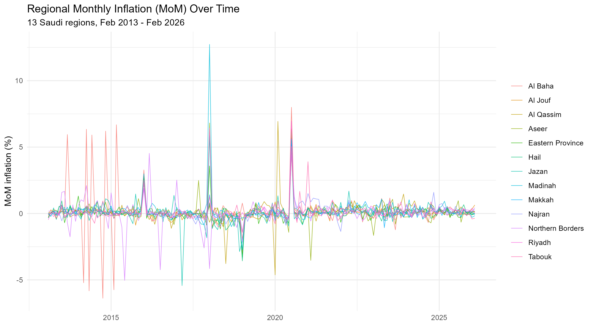
```

### Common temporal variation dominates the explainable variance

```{r figure2, fig.cap="Figure 2. Estimated month fixed effects (the common temporal component) over time, from the Stage-11 TWFE decomposition."}
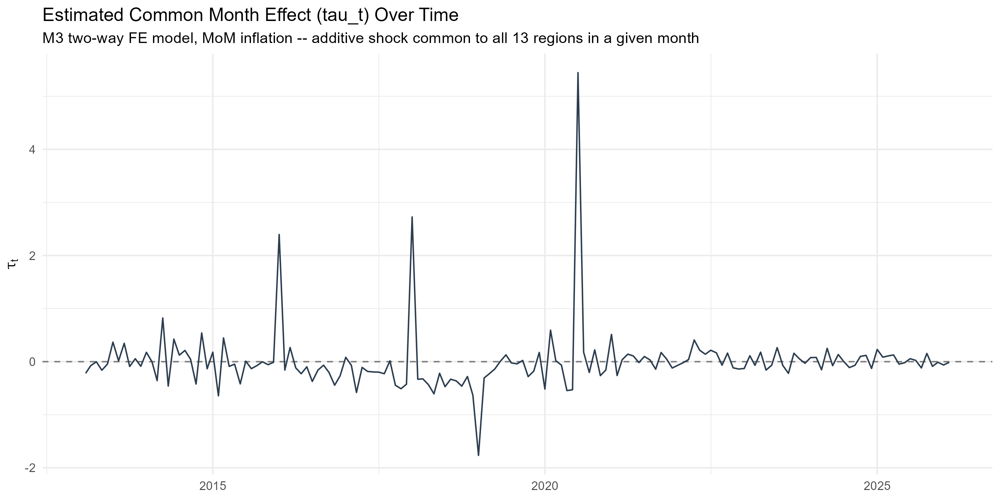
```

```{r table2}
kable(tv, caption = "Table 2. Two-way fixed-effects variance decomposition (Stage 11).",
      col.names = c("Component", "Sum of squares", "Share of total"), digits = 4)
```

Month fixed effects -- which absorb whatever common temporal variation is
shared across all 13 regions in a given month, without identifying which
specific mechanism (monetary policy, oil prices, a nationwide fiscal change,
or some combination) drives it -- alone account for
`r round(100*month_share,1)`% of the total sum of squares in regional
inflation, versus `r round(100*tv$share_of_total[tv$component=="Region (alpha_i)"],2)`%
for region fixed effects. This asymmetry is consistent with Ciccarelli and
Mojon's (2010) finding that a common time-varying factor, not persistent
cross-sectional heterogeneity, is the dominant source of co-movement; it is
reported here as a statistical decomposition, not as identification of a
specific causal driver.

### Contemporaneous and lag-1 spatial dependence are weak and not robust

Monthly permutation-based Global Moran's I (Stage 12), computed separately
for each of 157 months on both raw inflation and TWFE residuals, finds
`r moran_mtc$n_raw_p_lt_05[1]` of 157 months nominally significant at the raw
5% level -- but **`r moran_mtc$n_surviving_BH[1]` survive Benjamini-Hochberg
correction and `r moran_mtc$n_surviving_Holm[1]` survive Holm correction**,
for both the raw and TWFE-residual series. There is no robust evidence of
systematic contemporaneous spatial dependence.

```{r figure3, fig.cap="Figure 3. Monthly permutation Moran's I, raw inflation vs. TWFE residuals -- neither survives multiple-testing correction across 157 months."}
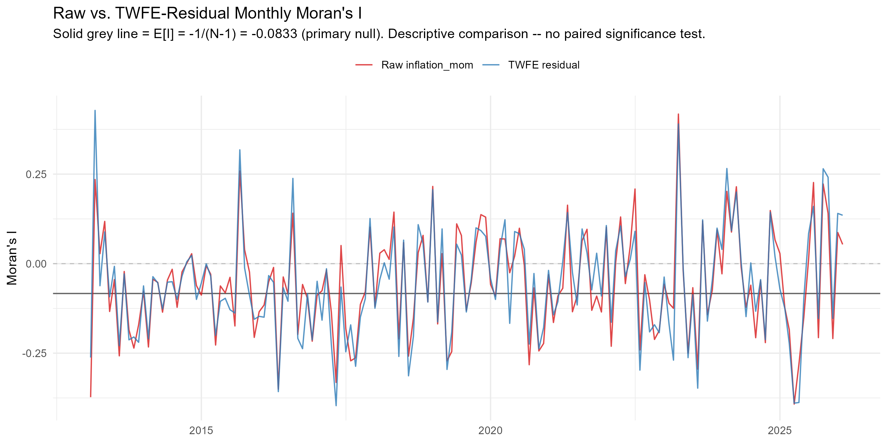
```

The lag-1 own/spatial dynamic model (Stage 13) similarly finds no robust
spatial predictive content: the spatial-lag coefficient
$\hat\theta$ = `r round(lag1_dk$estimate,4)` (Driscoll-Kraay SE =
`r round(lag1_dk$std_error,4)`, p = `r round(lag1_dk$p_value,3)`), confirmed
by a wild-cluster bootstrap (p = `r round(lag1_wcb$p_value_wcb,3)`, B =
`r lag1_wcb$n_bootstrap_reps`).

### Distributed spatial lags (K=3, K=6) remain non-significant

```{r figure4, fig.cap="Figure 4. Distributed spatial-lag coefficients (theta_1, theta_2, theta_3), K=3, Driscoll-Kraay 95% CI (Stage 14)."}
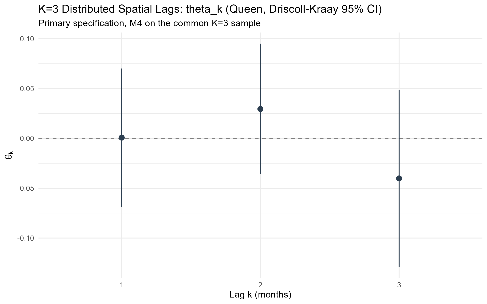
```

```{r table4}
kable(fr_horizon, caption = "Table 4. Dynamic-horizon robustness: cumulative spatial effect and joint test, K=1/3/6 (Stage 18, common sample).",
      digits = 4)
```

The joint test of $\theta_1=\theta_2=\theta_3=0$ at K=3 gives p =
`r round(dsl_k3_wcb$p_value_wcb[dsl_k3_wcb$test=="Joint (theta_1,theta_2,theta_3)"],3)`
(wild-cluster bootstrap, B = `r dsl_k3_wcb$n_bootstrap_reps[1]`); the
cumulative distributed spatial effect $\Theta_3$ =
`r round(dsl_k3_wcb$statistic[dsl_k3_wcb$test=="Cumulative Theta_3"],4)`
(p = `r round(dsl_k3_wcb$p_value_wcb[dsl_k3_wcb$test=="Cumulative Theta_3"],3)`).
Extending to K=6 does not change this conclusion (Table 4 above; joint p
ranges from `r round(min(fr_horizon$joint_p_value),3)` to
`r round(max(fr_horizon$joint_p_value),3)` across K=1/3/6 on one common
sample).

### Nonlinear and state-dependent evidence is suggestive only

```{r nonlinear-summary}
kable(nl_family[, c("test","primary_p_value_type","raw_p_value","p_BH","p_Holm")],
      caption = "Nonlinear/state-dependent hypothesis family (Stage 15).", digits = 4)
```

Across the pre-specified five-test nonlinear family (high-inflation-regime
interaction, smooth spline nonlinearity, quadratic diagnostic, threshold
existence, and positive/negative asymmetry), only the smooth-spline test is
nominally significant at the raw 5% level
(p = `r round(nl_family$raw_p_value[nl_family$test=="B: Joint spline nonlinearity"],4)`),
and it does **not** survive Benjamini-Hochberg correction (p =
`r round(nl_family$p_BH[nl_family$test=="B: Joint spline nonlinearity"],4)`)
and fails to replicate under KNN spatial weights or at a six-month horizon
(Stage 15, Section F). This is reported as suggestive, non-actionable
evidence, not as an established nonlinear relationship.

### Verified national shock episodes show no robust instability

Three officially verified national episodes (the December 2015 energy-price
reform, the January 2018 VAT-introduction/energy-price package, and the July
2020 VAT rate increase) were tested for associated changes in own-region
persistence, spatial predictive content, and their combination. Across the
pre-specified nine-test family (3 episodes x {spatial, own, combined}),
`r sum(ss_family$sig_raw_05)` of 9 tests were nominally significant at raw
5%, and `r sum(ss_family$sig_BH_05)` survived Benjamini-Hochberg correction.
No robust event-conditioned parameter instability is found. A
post-audit sensitivity check using geographically corrected great-circle
distance weights produced nominal evidence of spatial dynamics for the
July 2020 event under the alternative KNN
(`r p_text(ss_e3$p_value_asymptotic[ss_e3$weight_spec=="KNN (k=4)"])`)
and distance-band
(`r p_text(ss_e3$p_value_asymptotic[ss_e3$weight_spec=="Distance band"])`)
matrices (Stage 16, Section J; Driscoll-Kraay asymptotic p-values). This
pattern does not replicate under the prespecified primary Queen matrix
(`r p_text(ss_e3$p_value_asymptotic[ss_e3$weight_spec=="Queen (primary)"])`)
or its wild-cluster bootstrap inference
(`r p_text(ss_e3_queen$p_value_wcb)`, B = `r ss_e3_queen$n_bootstrap_reps`)
and therefore does not alter the study's primary conclusion. Given the
event's overlap with the COVID-19 period, the result is treated as a
matrix-sensitive robustness finding rather than independent evidence of a
spatial VAT effect.

### Inflation is stationary; CPI levels are not

Per-region unit-root testing (ADF and KPSS, both required to agree; Stage
17) finds `r n_infl_stationary` of 13 regions' inflation series stationary,
while `r n_cpi_nonstationary` of 13 regions' CPI *level* series are
non-stationary -- the expected pattern for a differenced/growth-rate series
versus a trending price index. A break-aware (Zivot-Andrews) sensitivity
check changes this conclusion for only 1 of 13 regions. The seasonal
(lag-12) coefficient is not significant
(estimate = `r round(st_seasonal$estimate,4)`, p =
`r round(st_seasonal$p_value,3)`), and no longer-memory extension (lag-6,
lag-12) produces a materially decisive BIC improvement over the K=3
reference (Stage 17, Section D).

## Robustness and Additional Analyses

```{r table3}
kable(fr_final, caption = "Table 3. Final K=3 dynamic TWFE model: coefficients (Driscoll-Kraay).", digits = 4)
kable(fr_meta, caption = "Table 3 (continued). Final model metadata.", digits = 4)
```

```{r table5}
fr_robustness <- read.csv("results_v2/final_robustness/tables/fr_K_robustness_summary.csv")
kable(fr_robustness, caption = "Table 5. Final robustness summary (Stage 18).", digits = 4)
```

The final K=3 model's central conclusion -- non-significant joint spatial
predictive dependence -- is unchanged: across all 13 leave-one-region-out
re-estimations (joint p range
[`r round(fr_loro$min_p,3)`, `r round(fr_loro$max_p,3)`]; Figure 5 below);
across influential-month exclusion specifications;

```{r figure5, fig.cap="Figure 5. Leave-one-region-out cumulative spatial effect (Theta_3), Driscoll-Kraay 95% CI (Stage 18)."}
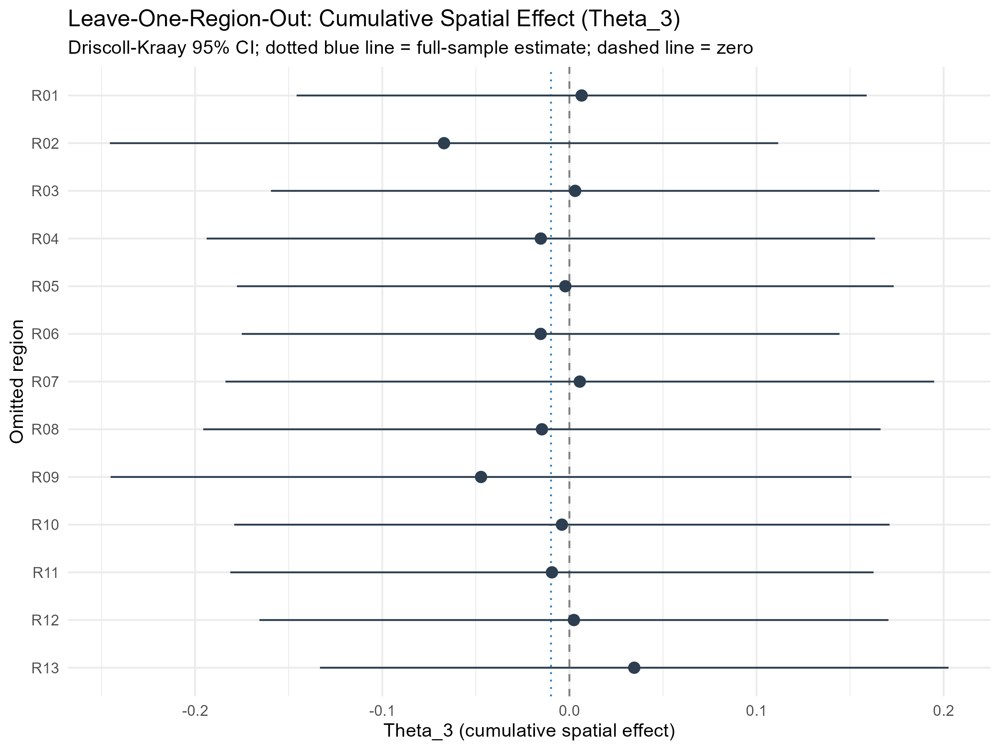
```
 across Queen, KNN
(k=4), and distance-band spatial weights (Table 5); across K=1/3/6 dynamic
horizons (Table 4); across the T0/T1 temporal-specification comparison
confirming Stage 17's own finding; and across four inference methods --
Driscoll-Kraay, region-clustered, classical (diagnostic only), and a final
B=9999 wild-cluster bootstrap (p =
`r round(fr_inference$p_value[fr_inference$method=="Wild cluster bootstrap (B=9999)"],4)`).

### Statistical power: what spatial effect size could this design detect?

```{r power-numbers}
mde_summary <- read.csv("results_v2/presubmission_refinement/power_mde/mde_summary.csv", stringsAsFactors = FALSE)
power_class <- readLines("results_v2/presubmission_refinement/power_mde/power_classification.txt")[1]
max_grid_power <- mde_summary$value[mde_summary$quantity == "Max power achieved within the pre-specified grid (|Theta_3|<=0.20)"]
```

Because the null/weak spatial result above could in principle reflect either
a genuinely small (or zero) true effect, or simply limited statistical power
given N=13, a calibrated Monte Carlo simulation was run -- **as a
design-sensitivity check, not a new empirical finding** -- to ask what
magnitude of cumulative three-month spatial effect (Theta_3) this exact
design (N=13, T=154, the observed Queen weights, the locked K=3
specification, and residual dependence preserved via a moving-block
bootstrap) could reliably detect. Full design and results are in
**Appendix B**. Summary: across a pre-specified, symmetric effect-size grid
(|Theta_3| up to 0.20), estimated power never exceeds
`r round(100*max_grid_power,1)`%, short of the conventional 80% threshold;
the design is classified **`r power_class`**. This means the design can
reliably detect only moderate-to-large cumulative spatial effects, and
**small spatial effects cannot be excluded by this study's null/weak
result** -- a point carried through to the [Discussion] and [Limitations]
below.

## Discussion

The central empirical pattern -- a large, statistically dominant share of
common temporal variation, meaningful own-region persistence, and no robust
spatial predictive dependence across neighbouring regions -- is economically
plausible for several reasons. These are offered as **possible
explanations (category C)**, distinct from what is directly **statistically
estimated (category A)** above and from any specific **economic
interpretation (category B)** of it; none is a mechanism established by
this analysis, and the month fixed effects themselves identify only that
temporal variation is shared across regions, not which economic force
produces it:

- **National pricing forces may dominate regional neighbour effects.** Saudi
  Arabia is a single-currency, administratively centralized economy with
  nationally set fuel and utility prices and a single VAT rate; the channels
  through which one region's price pressure would spread specifically to its
  geographic neighbours (rather than to the whole country at once) may
  simply be weak relative to nationwide drivers.
- **Integrated national markets.** If goods, especially the CPI basket's
  heavily weighted tradable and administered-price components, are sourced
  and priced through national or global supply chains rather than
  region-to-region trade, geographic contiguity may not be the right
  channel through which any real inflation transmission occurs (consistent
  with Auer, Levchenko & Sauré's finding that input-output linkages, not
  proximity per se, carry inflation spillovers internationally).
- **Common policy/macro shocks are one plausible source of the common
  temporal variation, not a separate finding.** VAT changes and oil-price
  movements, if they matter, would hit all regions in the same calendar
  month; a model that already includes month fixed effects has, by
  construction, absorbed whatever common temporal variation exists that
  month, from whatever source -- so the *residual* spatial test correctly
  finds little left to explain, regardless of which specific national force
  (if any single one dominates) generated that common variation.
- **Administrative-region aggregation may be too coarse.** Thirteen large
  administrative regions aggregate substantial internal heterogeneity (e.g.
  a large city and its rural periphery within one region); if genuine
  spatial spillovers operate at a finer geography (city or district level)
  or through specific product categories rather than the aggregate CPI
  basket, this panel's resolution could not detect them even if they exist.

## Limitations

- **Small cross-section (N=13) limits what can be ruled out, not the
  validity of the test itself.** The time dimension is reasonably long for
  monthly dynamics (T=154 months in the final K=3 sample), and every
  inference method used here (Driscoll-Kraay, cluster-robust, wild-cluster
  bootstrap) was chosen specifically because ordinary asymptotics are
  unreliable with only 13 cross-sectional units. But N=13 fundamentally
  limits statistical *power*, particularly for weak or heterogeneous
  spatial effects and for the more complex state-dependent/nonlinear
  specifications explored in Stage 15. A calibrated Monte Carlo power
  analysis (Appendix B) finds that this design has adequate power to
  detect only moderate-to-large cumulative spatial effects (roughly
  |Theta_3| > 0.20) and limited power below that -- the pre-specified
  effect-size grid's 80%-power threshold was not reached within the tested
  range. **This is a distinction between absence of evidence and evidence
  of absence**: the null/weak result reported here means no spatial
  predictive dependence *of the magnitude this design could reliably
  detect* was found -- it does not mean, and this paper does not claim,
  that smaller spatial effects are ruled out. The width of the observed
  confidence interval for the cumulative spatial effect (Table 3) is
  consistent with this: it remains wide enough to admit economically small
  effects alongside zero.
- **Administrative-region aggregation**, as discussed above, may obscure
  finer-grained spatial dependence.
- **No region x category CPI history is available** over a long enough
  window to test whether spatial dependence is concentrated in specific
  product categories (e.g. housing, transport) rather than the aggregate
  index.
- **Moderate residual temporal persistence remains** (Stage 17-18; final
  classification T2) and is not resolved by any tested extension -- the
  final model's residuals still show some region-level serial dependence
  that this analysis does not fully explain.
- **Spatial-weight uncertainty.** Only Queen contiguity, KNN (k=4), and a
  distance-band matrix were tested; Queen and Rook contiguity are identical
  in this map and are not independent checks. KNN and distance-band
  neighbours use great-circle distances between WGS84 region centroids; the
  distance band is 1.05 times the largest nearest-neighbour distance (about
  501 km). Versions up to v1.0 applied Euclidean distance to longitude/latitude
  degrees; correcting this changed the KNN and distance-band robustness
  numbers; the main conclusions are unchanged, with one added qualification
  for the July 2020 episode (Stage 16 above; see
  `results_v2/distance_correction/`). A genuinely different notion
  of "neighbour" (e.g. trade-flow-weighted) was not tested.
- **No causal identification.** Every result in this paper is a predictive/
  associational test, not a causal design; in particular, the verified
  national shock episodes are tested for *association* with parameter
  instability, not for a causal treatment effect, and two of the three
  episodes are explicitly confounded with other simultaneous national
  events (documented in Stage 16's registry) and cannot be causally isolated
  with this data.
- **Local/city-level mechanisms are not identifiable** in the current,
  region-level data -- a null finding at the administrative-region level
  does not rule out spatial dependence at a finer geography.

## Future Research

The findings above -- no robust spatial predictive dependence at the
13-region level, but a design with limited power for small effects and
several documented reasons administrative-region aggregation might mask a
real but finer-grained pattern -- motivate a **sequential** research
agenda, each step building on what the previous one would find, rather
than a list of unrelated extensions.

**Step 1 -- Finer geography.** *Question:* does spatial predictive
dependence emerge at the city or governorate level even if it is weak at
the 13-region level? *Motivation:* administrative-region aggregation
combines, within one region, a major city and its rural periphery, which
could average away genuine local price propagation. This step requires
sub-regional CPI data that, to our knowledge, does not currently exist in
a form usable for this analysis -- we do not claim it does; obtaining or
constructing it would be the first task of this step, not an assumption of
it.

**Step 2 -- Category-level inflation.** *Question:* does spatial dependence
differ across inflation components -- food, housing/utilities, transport,
restaurants/accommodation -- rather than being uniformly absent in the
aggregate index? *Motivation:* headline CPI averages across categories
with plausibly very different spatial economics (e.g. a nationally-priced
administered utility versus a locally-sourced perishable food category);
a sector-specific test could find dependence the aggregate index cannot.
This step is explicitly constrained by the documented historical
region-by-category CPI data limitation already noted in this paper's
Limitations -- a long enough region x category panel is not currently
available.

**Step 3 -- Economic connectivity beyond geography.** Building on whatever
Steps 1-2 find, future work may move beyond a purely geographic
contiguity matrix $W$ to economically meaningful connectivity: transport
links, internal trade flows, logistics networks, labour/consumer mobility,
or payment flows, where valid data become available. The central
hypothesis this step would test -- **not demonstrated by MAKANI** -- is
that economic connectivity may be more informative than administrative
adjacency for detecting real inflation co-movement across regions.

**Step 4 -- Heterogeneous interactions.** Only with richer cross-sectional
data (from Steps 1-3) would it become meaningful to examine whether spatial
predictive content varies systematically with regional characteristics,
i.e. interactions of the form $W\pi_{t-k} \times Z_i$, where $Z_i$ might
represent urbanization, market structure, logistics connectivity, sector
composition, population density, or another theoretically justified
regional characteristic. **This interaction is explicitly NOT added to the
current MAKANI empirical model** -- Stage 15 already tested state-dependent
spatial effects along one dimension (the national inflation regime) and
found no robust evidence, and this guardrail was maintained throughout the
pre-submission refinement reported here. Step 4 is framed as a hypothesis
generated by the present study for future work with adequate data, not as
an extension to reopen now.

## Conclusion

```{r conclusion-numbers}
spatial_class  <- readLines("results_v2/final_robustness/tables/fr_J_final_classifications.txt")[1]
temporal_class <- readLines("results_v2/final_robustness/tables/fr_J_final_classifications.txt")[2]
```

**Common temporal variation accounts for a substantial share of regional
inflation dynamics, while the available 13-region panel provides no robust
evidence of spatial predictive dependence after accounting for regional
dynamics.** This is the central conclusion of ten confirmatory stages
spanning contemporaneous spatial dependence, lag-1 predictive content,
distributed lags to six months, nonlinear and state-dependent extensions,
verified national shock episodes, stationarity, seasonality, and a final
robustness battery covering region omission, influential months,
spatial-weight choice, dynamic horizon, and inference method. The final
spatial evidence classification is **`r spatial_class`**, and the final
temporal-dynamics classification -- reported separately, as the two are
conceptually distinct -- is **`r temporal_class`**.

This is not evidence that "no spatial dependence exists" in any absolute
sense -- no robust spatial predictive dependence is detected in the
available data. That is, at the administrative-region level, over the
horizons tested, and after accounting for common temporal variation and
each region's own persistence, no *predictive* spatial signal survives
rigorous, multiply-corrected, robustness-checked testing. Common temporal
variation and local region-specific dynamics, not spatial transmission
across neighbouring regions, characterize the empirical pattern of Saudi
regional inflation that this study identifies. Because the available
cross-section (N=13) limits this design's power to moderate-to-large
effects (Appendix B), this finding should be read as "no robust evidence
of the spatial effect sizes this study could reliably detect," not as
evidence that small spatial effects are absent.

## References {.unnumbered}

Auer, R., Levchenko, A. A., & Sauré, P. (2017). *International Inflation
Spillovers through Input Linkages*. BIS Working Paper No. 623. Bank for
International Settlements. <https://www.bis.org/publ/work623.pdf>

Ciccarelli, M., & Mojon, B. (2010). Global Inflation. *The Review of
Economics and Statistics*, 92(3), 524-535.
<https://direct.mit.edu/rest/article/92/3/524/57826/Global-Inflation>

Elhorst, J. P. (2017). Spatial Panel Data Analysis. In S. Shekhar, H. Xiong,
& X. Zhou (Eds.), *Encyclopedia of GIS* (2nd ed., pp. 2050-2058). Springer.
<https://doi.org/10.1007/978-3-319-17885-1_1641>

Fareed, F., Rezghi, A., & Sandoz, C. (2023). *Inflation Dynamics in the Gulf
Cooperation Council (GCC): What is the Role of External Factors?* IMF
Working Paper WP/23/263. International Monetary Fund.
<https://www.imf.org/en/Publications/WP/Issues/2023/12/15/Inflation-Dynamics-in-the-Gulf-Cooperation-Council-GCC-What-is-the-Role-of-External-Factors-542414>

Hasan, M. M., & Alogeel, H. (2008). *Understanding the Inflationary Process
in the GCC Region: The Case of Saudi Arabia and Kuwait*. IMF Working Paper
WP/08/193. International Monetary Fund.
<https://www.imf.org/external/pubs/ft/wp/2008/wp08193.pdf>

Marques, H., Pino, G., & Tena, J. D. Regional Inflation Dynamics Using
Space-Time Models. *Empirical Economics*.
<https://link.springer.com/article/10.1007/s00181-013-0763-9>

## Reproducibility

**Frozen baseline.** `baseline/v1.0/` (git tag `baseline-v1.0`, commit
`72147ab`), checksummed via `baseline/v1.0/MANIFEST.sha256` (38/38 files
verified after every subsequent stage, including this one). No file in it
was read, modified, or sourced by any v2 stage.

**Immutable region identity.** Every v2 stage uses the same 13-region
`region_id` (R01-R13), defined once in `data_v2/region_id_registry.csv` and
never re-derived, alongside the same alphabetically sorted `region_order`
used consistently for spatial-weight matrix construction from Stage 12
onward.

**Workflow.** R / `renv` (locked at R 4.4.1; `renv.lock` pins every package
version). No new package was installed at any v2 stage; where a desired
method's package was unavailable (e.g. `strucchange`, `tseries`, `urca`,
`plm`), the underlying well-established algorithm was implemented directly
in base R rather than altering the environment, documented explicitly in
each script's header.

**Staged scripts and commits (v2, Stages 9-19):**

```{r repro-table}
repro_table <- data.frame(
  Stage = c("9 (panel build)", "11 (TWFE decomposition)", "12 (Moran's I)",
            "13 (lag-1 spatial)", "14 (distributed lags)", "15 (nonlinear)",
            "16 (structural shocks)", "17 (stationarity/temporal)",
            "18 (final robustness)", "19 (manuscript integration)"),
  Script = c("scripts/09_panel_build.R", "scripts/11_twfe_common_shocks.R",
             "scripts/12_residual_spatial_tests.R", "scripts/13_lagged_spatial_transmission.R",
             "scripts/14_distributed_spatial_lags.R", "scripts/15_nonlinear_spatial_dynamics.R",
             "scripts/16_structural_shocks.R", "scripts/17_stationarity_temporal_dynamics.R",
             "scripts/18_final_robustness_model_lock.R", "paper.qmd (this file)"),
  Commit = c("9b4bc89", "e626dee", "e626dee", "f7f5d5d", "fd7ef10", "c63dba5",
             "bc4fde0", "e0566f5", "5565b1a", "(this commit)")
)
kable(repro_table, caption = "Staged v2 scripts and their commit hashes on branch `makani-v2-panel`.")
```

**Machine-readable outputs.** Every number reported in the Results and
Robustness sections above is read programmatically, at render time, from the
CSV/TXT tables committed alongside each stage's script (`results_v2/*/tables/`)
-- none is hand-typed. The full sensitivity analyses referenced but not
reproduced in full here (e.g. the complete leave-one-region-out table, the
full stationarity-by-region table) are available in those same directories.

## Appendix A: Exploratory Baseline Analysis (v1, Preliminary)

**Read this appendix as the project's original exploratory phase (Stages
1-8), retained here in full for transparency.** It precedes, and its
suggestive spatial-clustering reading is superseded in interpretation by,
the confirmatory dynamic-panel analysis in the main text above (Stages
9-18), which found no robust spatial predictive dependence after multiple-
testing correction and a full robustness battery. Where this appendix's
original language (below) describes a pattern as more than suggestive, the
main text's finding should be treated as authoritative.

### Data (v1)

This study uses monthly Consumer Price Index (CPI) data for Saudi Arabia's thirteen administrative regions, published by the General Authority for Statistics (GASTAT), reference (base) year 2023 = 100. The series spans January 2013 to February 2026 and reflects GASTAT's updated CPI methodology, effective August 2025, under which the regional-level series was re-linked back to 2013. Inflation is computed as the log difference of the CPI index, ln(CPI_t / CPI_(t-1)), for each region.

### Methodology (v1)

#### Data Engineering

The raw GASTAT series is rebuilt into an analysis-ready panel on every pipeline run rather than read from a static cache. The annual-average row included in the raw file for each year is excluded before any ordering, the month/year fields are coerced to integers (avoiding a lexicographic month order such as "1, 10, 11, 12, 2, ..."), and each region's series is explicitly sorted chronologically before the month-over-month log-difference is taken. This ordering step matters: computing the log-difference on a text-sorted series silently misattributes several months per year to the wrong prior period. The resulting long-format panel (`date`, `Region`, `CPI`, `inflation`) is the single input to every analysis step below.

#### Analytical Approach

To explore regional interactions, the data is transformed into a wide format, allowing the computation of a correlation matrix across regions.

Spatial analysis is conducted using regional shapefiles, enabling visualization of geographic variation in inflation patterns. In addition, the Global Moran's I statistic is computed on each region's mean inflation using a queen-contiguity spatial weights matrix, to test formally whether spatial clustering exists rather than relying on visual inspection of the map alone.

### Descriptive Statistics (v1)

```{r echo=FALSE, eval=!knitr::is_html_output()}
library(flextable)   ### Word:

region_stats <- read.csv("results/tables/region_statistics.csv")

region_stats_fmt <- region_stats
region_stats_fmt[ , -1] <- round(region_stats_fmt[ , -1] * 100, 2)
names(region_stats_fmt) <- c("Region", "Mean Inflation (%)", "Std. Dev. (%)",
                              "Min (%)", "Max (%)")

flextable(region_stats_fmt) |>
  theme_vanilla() |>
  autofit()
```

```{r echo=FALSE, eval=!knitr::is_html_output(), results='asis'}
cat("*Table A1. Descriptive statistics of monthly regional inflation rates (%).*")
```


```{r, echo=FALSE, eval=knitr::is_html_output()}
library(DT)

region_stats <- read.csv("results/tables/region_statistics.csv")

region_stats_fmt <- region_stats
region_stats_fmt[ , -1] <- round(region_stats_fmt[ , -1] * 100, 2)
names(region_stats_fmt) <- c("Region", "Mean Inflation (%)", "Std. Dev. (%)",
                              "Min (%)", "Max (%)")

datatable(region_stats_fmt,
  caption = "Table A1. Descriptive statistics of monthly regional inflation rates (%).",
  options = list(
    pageLength = -1,
    scrollX = TRUE
  ),
  rownames = FALSE
)
```


#### Distribution of Inflation

```{r, echo=FALSE, eval=!knitr::is_html_output()}
p_hist
```


```{r, echo=FALSE, eval=knitr::is_html_output()}
ggplotly(p_hist)
```
*Figure A1. Distribution of inflation across Saudi regions.*

The distribution of inflation suggests that values are concentrated within a narrow range, indicating relatively low dispersion across regions.

### Results (v1)

#### Correlation Analysis

Figure A2 illustrates the correlation structure across Saudi regions, revealing moderate to high positive relationships.

```{r, echo=FALSE}
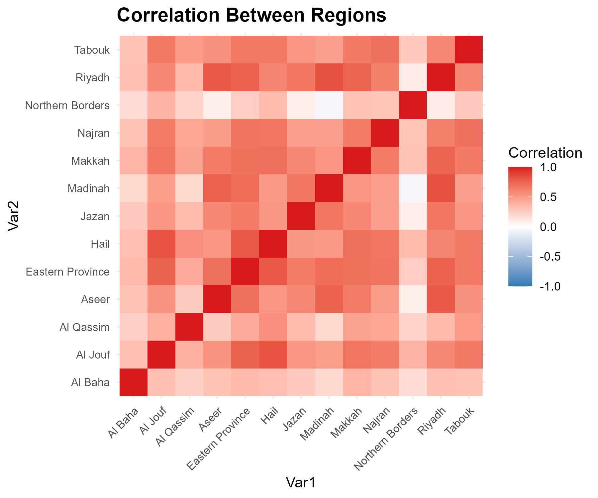
```
Figure A2: Correlation matrix of inflation across Saudi regions.

The correlation matrix indicates moderate to high positive correlations across
regions. On its own, a high pairwise correlation does not establish that
regions interact economically with one another; it is equally consistent with
all regions responding to the same national-level drivers (monetary policy,
oil prices, or nationwide fiscal shocks such as VAT changes) without any
direct regional interaction. This reading is confirmed directly by the main
text's confirmatory dynamic-panel analysis above, which finds no robust
spatial *predictive* dependence once common month effects are accounted for.

However, variations in correlation strength imply that regional-specific factors also play a role.

#### Statistical Significance of Regional Correlations

```{r, echo=FALSE}
corr_sig <- read.csv("results/tables/correlation_significance.csv")
n_total  <- nrow(corr_sig)
n_sig    <- sum(corr_sig$Significant_at_5pct)
n_sig_bh <- sum(corr_sig$Significant_BH_5pct)
not_sig  <- corr_sig[!corr_sig$Significant_at_5pct, ]
nb_involved <- sum(grepl("Northern Borders", not_sig$Region_1) | grepl("Northern Borders", not_sig$Region_2))
```

Correlation coefficients alone do not indicate whether a relationship is
statistically distinguishable from zero. Testing all `r n_total` regional
pairs individually (Pearson correlation test), `r n_sig` of `r n_total`
pairs (`r round(100 * n_sig / n_total, 1)`%) are significant at the raw 5%
level. Of the `r n_total - n_sig` non-significant pairs, `r nb_involved`
involve the Northern Borders region. This pattern **may reflect** the
relatively distinct economic characteristics of the Northern Borders region
(e.g. population size, trade exposure, or border-related retail dynamics);
however, this study does not formally test which of these factors, if any,
is responsible, and the pattern could equally be driven by chance given the
number of pairwise tests performed. This should be read as a descriptive
observation rather than a causal explanation.

Because 78 pairwise tests are performed simultaneously, the raw 5% threshold
understates the false-positive risk. Applying a Benjamini-Hochberg (FDR)
correction across all 78 tests, `r n_sig_bh` of `r n_total` pairs remain
significant `r if (n_sig_bh == n_sig) "— identical to the raw-p-value count, so the multiple-testing concern does not change the substantive conclusion here" else paste0("(compared with ", n_sig, " under the uncorrected threshold)")`.

---

#### Spatial Analysis (Map)

```{r, echo=FALSE, eval=!knitr::is_html_output()}
p_map
```

Figure A3: Spatial distribution of inflation across Saudi regions.
However, the spatial map highlights variation across regions, indicating that inflation is not uniformly distributed geographically.

```{r, echo=FALSE, eval=knitr::is_html_output()}
ggplotly(p_map)
```

---

#### Spatial Autocorrelation (Moran's I)

The correlation matrix above treats all regions symmetrically and ignores geography.
To test formally whether regions with similar inflation levels tend to be
geographic neighbours, we compute the Global Moran's I statistic on mean
regional inflation, using a queen-contiguity spatial weights matrix built from
the regional boundaries (`scripts/06_spatial_autocorrelation.R`).

```{r, echo=FALSE}
moran_summary    <- read.csv("results/tables/moran_test.csv")
moran_mc_summary <- read.csv("results/tables/moran_mc_test.csv")
```

Moran's I ranges from -1 (perfect spatial dispersion) to +1 (perfect spatial
clustering), with a value near 0 indicating a spatially random pattern. The
estimated statistic is **I = `r round(moran_summary$I, 3)`**
(z = `r round(moran_summary$z_value, 2)`,
p = `r signif(moran_summary$p_value, 3)`).

With only 13 regions, this p-value relies on an asymptotic (normal/randomisation)
approximation that may not hold well at such a small sample size. As a
robustness check, we additionally computed a Monte Carlo permutation test
(`r moran_mc_summary$n_simulations` random re-shufflings of the map): this
gives **I = `r round(moran_mc_summary$I, 3)`, p =
`r signif(moran_mc_summary$p_value, 3)`**. `r if (moran_mc_summary$p_value >= 0.05 && moran_summary$p_value < 0.05) "This permutation-based p-value is above the conventional 0.05 threshold, in contrast to the asymptotic test above — the evidence for spatial clustering is therefore borderline and sensitive to the testing method, and should be interpreted with caution rather than treated as a firmly established result." else "This is consistent with the asymptotic test above."`

This full-sample, time-collapsed test is superseded by the main text's
monthly permutation Moran's I (Stage 12), which tests every one of 157
months separately and finds that no nominal monthly significance survives
multiple-testing correction (see [Results]).

```{r, echo=FALSE}
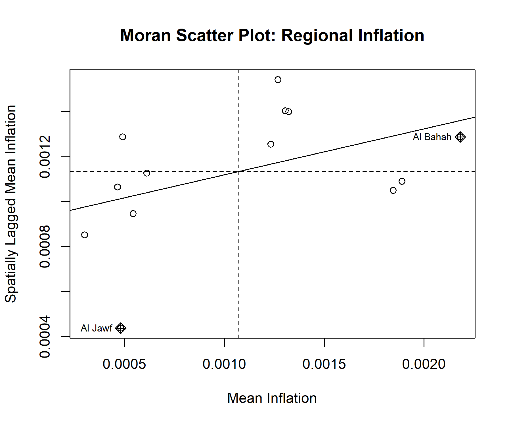
```
Figure A4: Moran scatter plot of regional mean inflation. The horizontal axis
shows each region's own mean inflation; the vertical axis shows the average
mean inflation of its geographic neighbours. A positive slope indicates
spatial clustering (similar values located near each other).

```{r, echo=FALSE, results='asis'}
if (moran_summary$p_value < 0.05) {
  cat(
    "With p =", signif(moran_summary$p_value, 3),
    "(below the conventional 0.05 threshold), the positive Moran's I is",
    "nominally significant on this single full-sample test: regional",
    "inflation in Saudi Arabia's time-averaged pattern is not randomly",
    "distributed in space. As the main text's monthly-resolution",
    "confirmatory test shows, however, this full-sample pattern does not",
    "translate into robust month-by-month spatial predictive dependence."
  )
} else {
  cat(
    "With p =", signif(moran_summary$p_value, 3),
    "(above the conventional 0.05 threshold), the null hypothesis of no",
    "spatial autocorrelation cannot be rejected at conventional significance",
    "levels: on this evidence, regional inflation does not show a",
    "statistically significant spatial clustering pattern."
  )
}
```

---

#### Local Spatial Clusters (LISA)

Global Moran's I indicates whether spatial clustering exists overall, but not
*where* it occurs. To locate specific clusters, we compute the Local
Indicators of Spatial Association (LISA / local Moran's I) for each region,
classifying it as High-High or Low-Low (a region and its neighbours share
similarly high or low inflation — a cluster), High-Low or Low-High (a region
differs from its neighbours — a spatial outlier), or not statistically
significant (p ≥ 0.05).

```{r, echo=FALSE}
lisa_results <- read.csv("results/tables/lisa_results.csv")
n_sig_lisa   <- sum(lisa_results$Cluster != "Not significant")
```

```{r, echo=FALSE, eval=!knitr::is_html_output()}
library(flextable)
flextable(lisa_results) |> theme_vanilla() |> autofit()
```

```{r, echo=FALSE, eval=!knitr::is_html_output(), results='asis'}
cat("*Table A2. Local Moran's I (LISA) results by region.*")
```

```{r, echo=FALSE, eval=knitr::is_html_output()}
DT::datatable(
  lisa_results,
  caption = "Table A2. Local Moran's I (LISA) results by region.",
  options = list(pageLength = -1, scrollX = TRUE),
  rownames = FALSE
)
```

```{r, echo=FALSE}
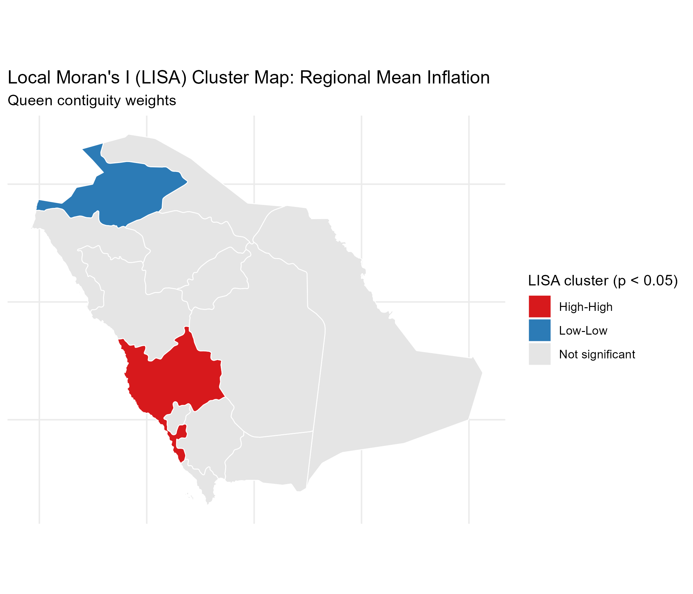
```
Figure A5: LISA cluster map of regional mean inflation (Queen contiguity, p < 0.05).

At the 5% significance level, `r n_sig_lisa` of the 13 regions form a
statistically significant local cluster or spatial outlier; the remainder do
not show a significant local pattern once tested individually. Given that
each local test is based on a single neighbourhood within a 13-region map,
these results should be read as exploratory/descriptive rather than
confirmatory, and are reported without multiple-testing correction.

Economically, these two clusters have plausible (though untested) regional
interpretations, offered here as they were in the original exploratory
phase. The High-High cluster centred on Makkah **may reflect**
the region's distinctive demand structure tied to religious tourism
(Hajj and Umrah), which generates strong, correlated price pressure in
hospitality, transport, and retail sectors shared with neighbouring
regions. The Low-Low cluster centred on Al Jawf **may reflect** the
comparatively smaller, less commercially dense regional economies of
Saudi Arabia's northern periphery, which would be expected to see more
muted and more similar price pressure than the country's larger commercial
and religious-tourism hubs. These interpretations are offered as plausible
readings consistent with known regional economic structure, not as
causal claims established by this analysis -- and, per the main text, the
confirmatory dynamic-panel analysis does not find evidence that either
cluster reflects ongoing spatial *transmission* rather than shared exposure
to common shocks.

---

#### Sensitivity Analysis (v1)

Three robustness questions are addressed here: (1) how much of the
correlation and Moran's I results are attributable to the two national VAT
policy shock months rather than ongoing regional co-movement, (2) whether a
single excluded month is wide enough given that VAT effects can plausibly
persist for longer than one month, and (3) how sensitive is the Moran's I
result to the choice of spatial weights matrix (Queen contiguity was used
throughout the analysis above). On point (2), the table below tests not
just the single shock month but also a +/-1 month window, the calendar
quarter starting at the shock, and a six-month window starting at the
shock, for each VAT event individually and combined.

```{r, echo=FALSE}
sensitivity_analysis  <- read.csv("results/tables/sensitivity_analysis.csv")
weights_sensitivity   <- read.csv("results/tables/weights_sensitivity.csv")

avg_cor_full <- sensitivity_analysis$Average_Correlation[sensitivity_analysis$Scenario == "Full Sample"]
avg_cor_excl <- sensitivity_analysis$Average_Correlation[sensitivity_analysis$Scenario == "Excl. Both (month)"]
avg_cor_excl6<- sensitivity_analysis$Average_Correlation[sensitivity_analysis$Scenario == "Excl. Both (6 months)"]
pct_drop     <- round(100 * (avg_cor_full - avg_cor_excl) / avg_cor_full, 1)
n_moran_sig_windows <- sum(sensitivity_analysis$Moran_p_value < 0.05)
n_moran_windows_total <- nrow(sensitivity_analysis)
```

```{r, echo=FALSE, eval=!knitr::is_html_output()}
flextable(sensitivity_analysis) |> theme_vanilla() |> autofit() |> fontsize(size = 8, part = "all")
```

```{r, echo=FALSE, eval=!knitr::is_html_output(), results='asis'}
cat("*Table A3. Sensitivity of correlation and Moran's I to the width of the excluded window around each VAT policy shock.*")
```

```{r, echo=FALSE, eval=knitr::is_html_output()}
DT::datatable(
  sensitivity_analysis,
  caption = "Table A3. Sensitivity of correlation and Moran's I to the width of the excluded window around each VAT policy shock.",
  options = list(pageLength = -1, scrollX = TRUE),
  rownames = FALSE
)
```

Excluding both shock months (January 2018 and July 2020 only) reduces the
average pairwise regional correlation from `r avg_cor_full` to
`r avg_cor_excl` (a `r pct_drop`% reduction); widening the excluded window
to six months gives a similar result (`r avg_cor_excl6`), so this is not an
artefact of the exact one-month cutoff. Across all `r n_moran_windows_total`
window specifications, Moran's I clears the 5% threshold in
`r n_moran_sig_windows` of them. Part of the correlation documented earlier
is therefore attributable to the two shared VAT shocks rather than ongoing
regional co-movement alone — though a meaningful common structure remains
even after excluding them. (The main text's Stage-16 confirmatory analysis
formally tests these same two episodes, plus the 2015 energy-price reform,
for associated parameter *instability* rather than correlation, and finds
no robust evidence of either.)

```{r, echo=FALSE, eval=!knitr::is_html_output()}
flextable(weights_sensitivity) |> theme_vanilla() |> autofit()
```

```{r, echo=FALSE, eval=!knitr::is_html_output(), results='asis'}
cat("*Table A4. Global Moran's I under alternative spatial weights matrices.*")
```

```{r, echo=FALSE, eval=knitr::is_html_output()}
DT::datatable(
  weights_sensitivity,
  caption = "Table A4. Global Moran's I under alternative spatial weights matrices.",
  options = list(pageLength = -1, scrollX = TRUE),
  rownames = FALSE
)
```

```{r, echo=FALSE}
n_weights_sig <- sum(weights_sensitivity$P_value < 0.05)
n_weights_total <- nrow(weights_sensitivity)
```

The Moran's I statistic clears the 5% threshold under `r n_weights_sig` of
the `r n_weights_total` weight matrix specifications tested (Queen and Rook
contiguity; not KNN or distance band). Table A4 is part of the frozen v1.0
exploratory baseline: its KNN and distance-band matrices use Euclidean
distance on longitude/latitude degrees and are kept unchanged as a
historical record (see `baseline/v1.0/METHODOLOGY_NOTE.md`, section 5).

*A note on spatial regression (SAR/SEM):* we also fitted intercept-only
Spatial Lag and Spatial Error models as a further check. With no regional
covariates in this dataset (no population, trade, or sectoral data)
beyond CPI itself, these reduce to a statistical exercise rather than an
explanatory economic model, and their likelihood-ratio test against OLS
was not significant here. We therefore do not report them as a full
result — a proper SAR/SEM belongs in future work once regional covariates
are available to distinguish what the spatial dependence actually reflects.

---

#### Moran's I Over Time (Exploratory)

The Global and Local Moran's I results above are computed on each region's
mean inflation across the entire 2013-2026 sample, which collapses the time
dimension into a single number per region. As an exploratory check (not a
formal time-varying spatial model), we recompute Global Moran's I
separately using each calendar year's regional mean inflation.

```{r, echo=FALSE}
moran_by_year <- read.csv("results/tables/moran_by_year.csv")
n_years_sig <- sum(moran_by_year$P_value < 0.05, na.rm = TRUE)
n_years_total <- nrow(moran_by_year)
```

```{r, echo=FALSE}
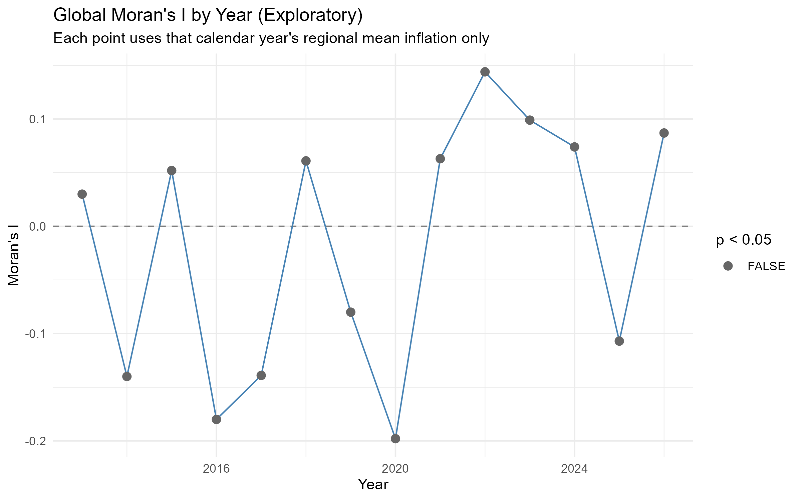
```
Figure A6: Global Moran's I computed separately for each calendar year's
regional mean inflation (exploratory). Red points indicate p < 0.05 for
that year.

```{r, echo=FALSE, eval=!knitr::is_html_output()}
flextable(moran_by_year) |> theme_vanilla() |> autofit() |> fontsize(size = 8, part = "all")
```

```{r, echo=FALSE, eval=!knitr::is_html_output(), results='asis'}
cat("*Table A5. Global Moran's I by calendar year (exploratory).*")
```

```{r, echo=FALSE, eval=knitr::is_html_output()}
DT::datatable(
  moran_by_year,
  caption = "Table A5. Global Moran's I by calendar year (exploratory).",
  options = list(pageLength = -1, scrollX = TRUE),
  rownames = FALSE
)
```

Moran's I fluctuates in sign and magnitude across years, reaching
conventional significance (p < 0.05) in `r n_years_sig` of `r n_years_total`
individual years. This should be read with one important caveat: each
year's test uses only 13 regional observations, so its statistical power
to detect a true spatial pattern is low. The absence of a significant
result in a given year is therefore not evidence that no spatial pattern
existed that year — only that a 13-region test could not reliably detect
one at that scale. The main text's monthly-resolution, multiply-corrected
Stage-12 test (157 months, pooling far more information than a year-by-year
split) supersedes this exploratory check.

**Taken together**, the checks in this appendix (Monte Carlo, alternative
weights, wider VAT-exclusion windows, and the year-by-year breakdown) were,
at the time of the original exploratory analysis, read as pointing toward a
real but modest full-sample spatial pattern. The main text's confirmatory
dynamic-panel sequence (Stages 9-18) tested this far more rigorously --
month by month, at multiple lag horizons, with multiple-testing correction,
and with a full robustness battery -- and found that this pattern does not
constitute robust spatial *predictive* dependence. The correlation and LISA
findings above remain valid descriptive facts about the data; their
interpretation as evidence of regional spatial interaction is superseded by
the main text.

### Economic Interpretation (v1, superseded — see main text [Discussion])

*The paragraphs below are the original v1 economic interpretation, retained*
*for transparency. The main text's [Discussion] section, informed by the*
*full confirmatory analysis, is the paper's authoritative interpretation.*

The findings suggest that inflation dynamics in Saudi Arabia are shaped by both national and regional forces.

The relatively high inter-regional correlations point to common macroeconomic drivers — oil price movements, monetary policy, and imported inflation — reinforced by shared national fiscal shocks such as the 2018 and 2020 VAT changes, which alone account for part of the correlation documented above. Superimposed on this national layer, the LISA results point to two more local, structural stories: Makkah's High-High cluster is consistent with religious-tourism demand pressure spilling into neighbouring markets, while Al Jawf's Low-Low cluster is consistent with the more muted demand conditions typical of the northern periphery. Together these suggest that regional inflation in Saudi Arabia is best understood as shared national shocks landing on a map of otherwise fairly heterogeneous local economies, rather than as regions actively transmitting inflation to one another — a reading fully consistent with, and now confirmed by, the main text's dynamic-panel findings.

This dual structure implies that while national policies are effective in maintaining overall price stability, regional disparities persist due to structural differences in local economies.

## Appendix B: Simulation-Based Power / Minimum-Detectable-Effect Analysis

**This is a design-sensitivity analysis, not a new empirical finding.** It
does not re-estimate, reinterpret, or alter any Stage 14-18 result reported
in the main text; it answers a different question: given this study's
sample (N=13, T=154), the observed Queen spatial-weight structure, the
locked Stage-14 K=3 specification, and the observed residual dependence,
what magnitude of cumulative three-month spatial predictive effect
(Theta_3 = theta_1+theta_2+theta_3) could this design plausibly have
detected? Full script: `scripts/20_power_mde_presubmission.R`. Full
narrative report: `results_v2/presubmission_refinement/power_mde/POWER_MDE_REPORT.md`.

### Design

```{r appendixB-design}
sim_design <- read.csv("results_v2/presubmission_refinement/power_mde/simulation_design.csv", stringsAsFactors = FALSE)
kable(sim_design, caption = "Table B1. Simulation design (pre-specified before any replication was run).", col.names = c("Parameter", "Value"))
```

**Data-generating process (fixed-regressor design):** own-lag and
spatial-lag regressor values are held at their values actually observed in
the locked K=3 estimation sample (region and month fixed effects included).
The simulated outcome is
$y^*_{it} = \widehat{y}^{\,0}_{it} + \theta_1 W\pi_{i,t-1} + \theta_2 W\pi_{i,t-2} + \theta_3 W\pi_{i,t-3} + e^*_{it}$,
where $\widehat{y}^{\,0}$ is the fitted value from the restricted
(no-spatial-lag) model and $e^*$ is a residual draw from a moving-block
bootstrap of that restricted model's observed residuals (block length 6
months primary, preserving observed cross-sectional dependence within each
monthly block and short-range temporal dependence within each 6-month
block; 12 months tested as a sensitivity). This is a standard, documented
simplification relative to a fully recursive dynamic re-simulation of the
panel -- stated explicitly, not hidden.

**Inference:** the primary rejection rule is the same Driscoll-Kraay joint
Wald test used throughout Stages 14-18 (running a full B=9999 wild-cluster
bootstrap inside thousands of replications is not computationally
tractable). This choice is validated, not merely assumed: at 3 selected
effect sizes, DK-based and nested-wild-cluster-bootstrap-based (B=199)
rejection rates were compared directly.

### Validation: DK asymptotic vs. nested wild-cluster bootstrap

```{r appendixB-validation}
sim_validation <- read.csv("results_v2/presubmission_refinement/power_mde/simulation_validation.csv", stringsAsFactors = FALSE)
kable(sim_validation, caption = "Table B2. DK-based vs. wild-cluster-bootstrap-based power, 3 selected effect sizes.", digits = 3)
```

All three checked points agree within 2 Monte Carlo standard errors,
supporting the use of the (far cheaper) DK-based rule as the primary
simulation inference rule for the full grid.

### Power curve

```{r appendixB-figure1, fig.cap="Figure B1. Simulated power vs. true cumulative spatial effect (Theta_3), primary design."}
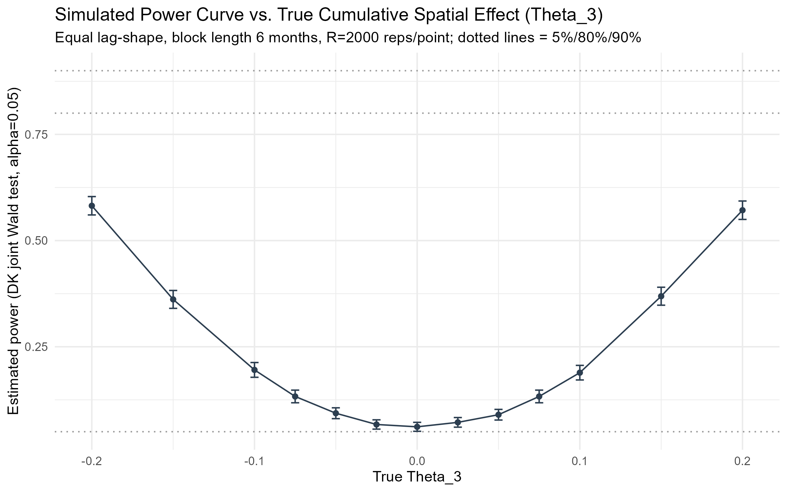
```

```{r appendixB-figure2, fig.cap="Figure B2. Power curve by assumed lag-shape (equal vs. front-loaded) -- power is conditional on this assumption."}
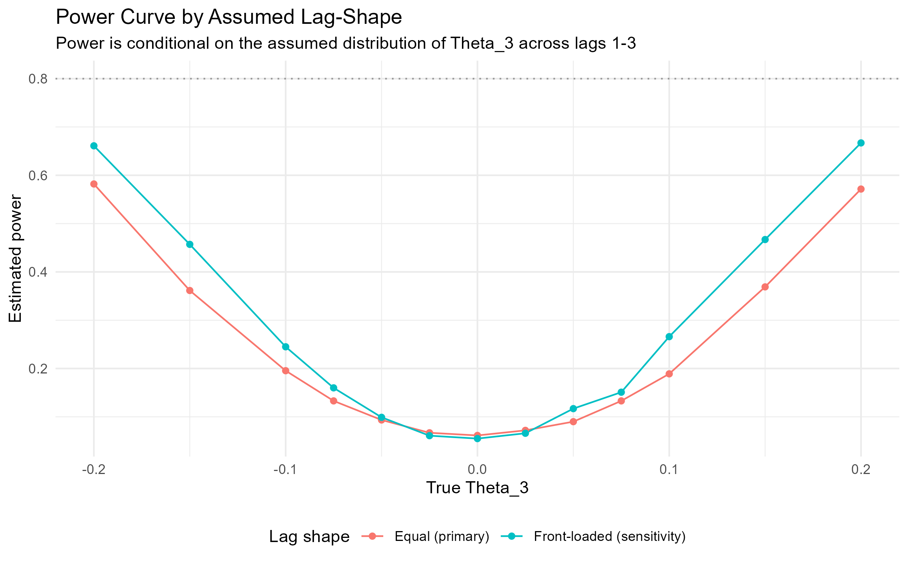
```

```{r appendixB-figure3, fig.cap="Figure B3. Observed estimate and 95% CI placed against the simulated detectable-effect scale."}
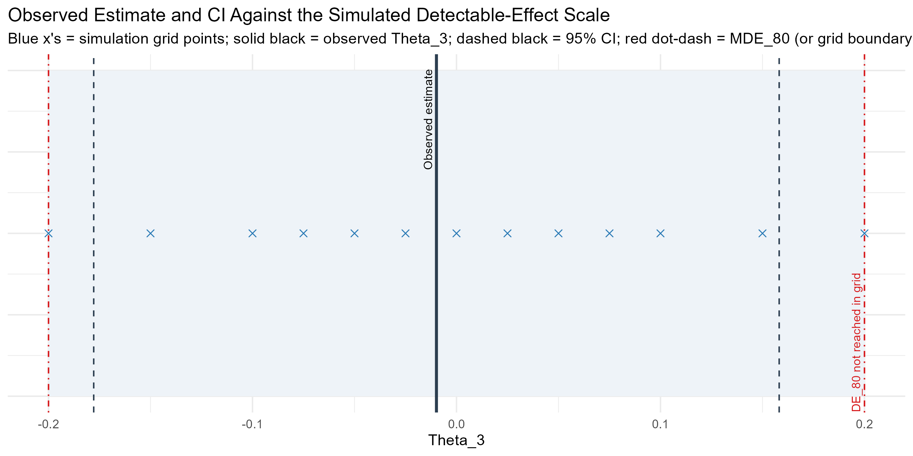
```

```{r appendixB-table-power}
power_curve_full <- read.csv("results_v2/presubmission_refinement/power_mde/power_curve.csv", stringsAsFactors = FALSE)
kable(power_curve_full, caption = "Table B3. Full power curve: primary, front-loaded-shape sensitivity, and block-length sensitivity.", digits = 4)
```

### MDE and power classification

```{r appendixB-mde}
kable(mde_summary[, c("quantity", "value")], caption = "Table B4. Minimum-detectable-effect (MDE) summary.", digits = 4)
```

**Power classification: `r power_class`.** Estimated power never exceeds
`r round(100*max_grid_power,1)`% anywhere within the pre-specified grid
(|Theta_3| up to 0.20, the largest magnitude tested); MDE_80 and MDE_90
were therefore not reached within the simulated range, and are NOT
extrapolated beyond it (extending the grid after seeing this would itself
be a form of specification search this analysis is designed to avoid). An
analytic single-parameter sanity check, using the LOCKED observed
Driscoll-Kraay standard error for the cumulative effect (Stage 18), gives
an approximate MDE_80 around 0.24 and MDE_90 around 0.28 -- consistent
with, and corroborating, the simulation's conclusion that the pre-specified
grid did not reach 80% power. This analytic figure is a sanity check only
and is not a substitute for the simulation result.

### What this does, and does not, imply for the main-text finding

- **Does not imply:** that the null/weak spatial result in the main text is
  "strong" evidence of zero spatial dependence -- it is not automatically
  treated as such.
- **Does imply:** this design has limited power to detect small spatial
  effects, and adequate-but-not-complete power for moderate-to-large ones
  (the largest tested effect, |Theta_3|=0.20, was detected only
  `r round(100*max_grid_power,1)`% of the time). Small spatial effects
  cannot be ruled out by this study.
- **Does not imply:** that a larger true effect is likely -- the analysis
  says nothing about which true effect size is more probable, only what
  this design could detect if one were present.

### Limitations of this power analysis

- Fixed-regressor design (see above) rather than a fully recursive dynamic
  re-simulation.
- Moving-block-bootstrap residuals approximate, but do not perfectly
  reproduce, the true (unknown) dependence structure of the actual error
  process.
- The DK-vs-WCB validation used a modest sample (100 replications x 3
  effect sizes); Table B2 reports the associated Monte Carlo uncertainty.
- Power is estimated only at the pre-specified grid points; MDE values are
  linearly interpolated between them, not separately simulated.
- This analysis assumes the same K=3 horizon and Queen weight structure as
  the locked design; it was not extended to K=6, alternative weights, or
  nonlinear specifications, consistent with this stage's guardrail against
  reopening Stages 14-18.
